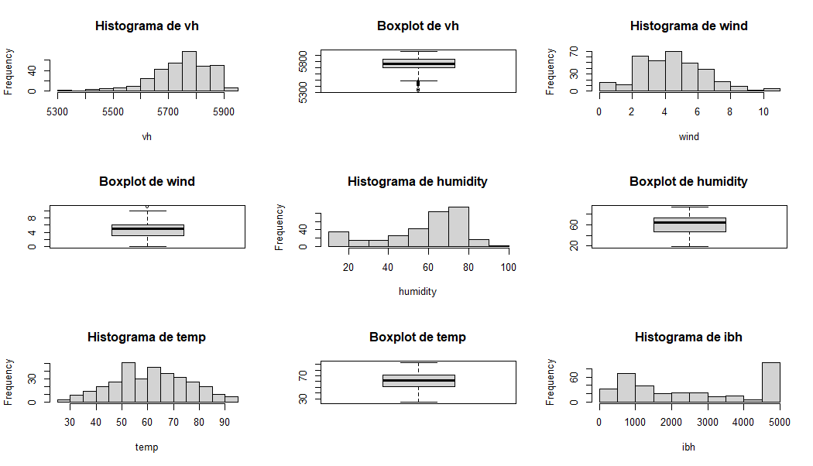
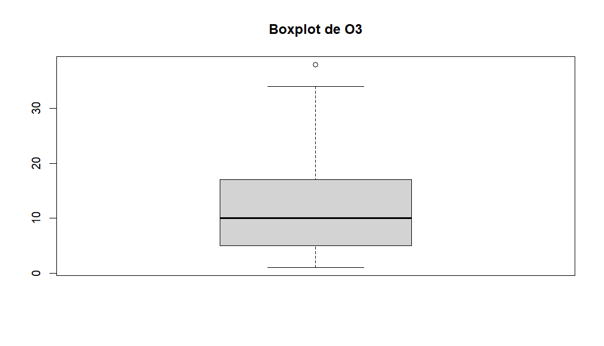
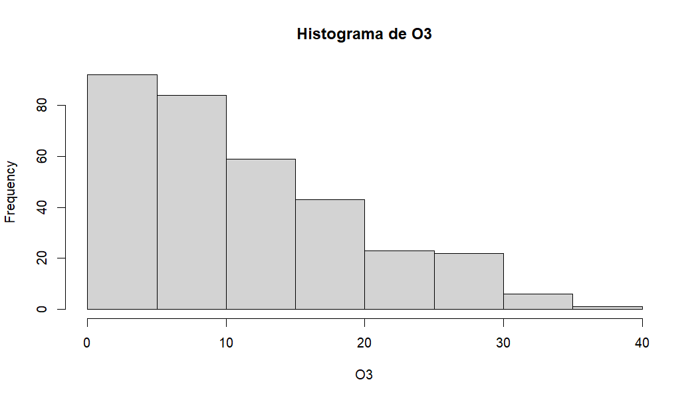
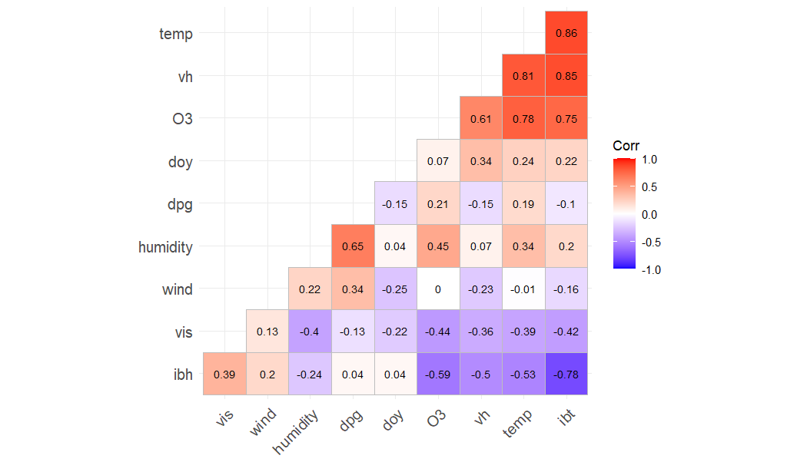
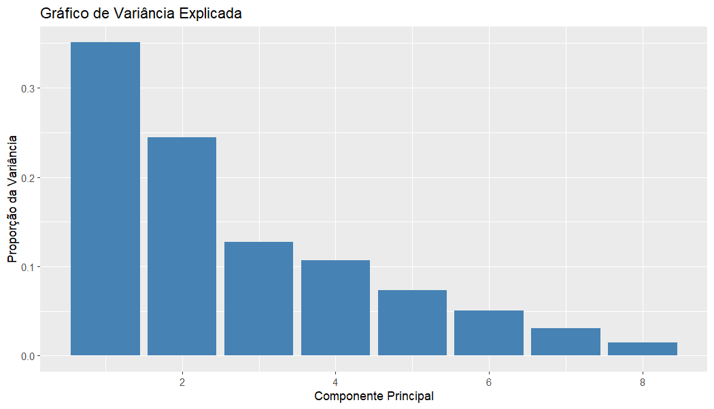
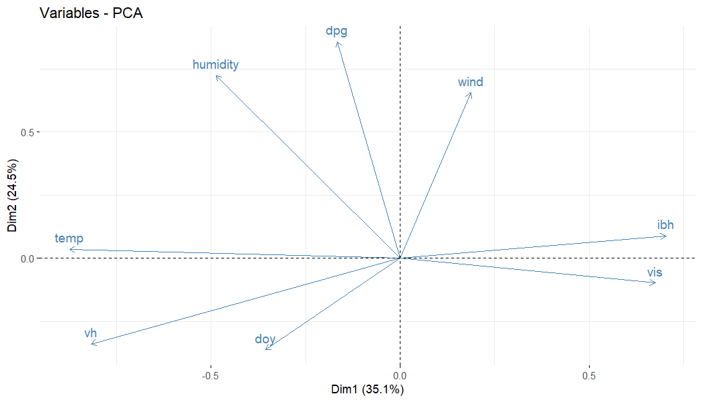
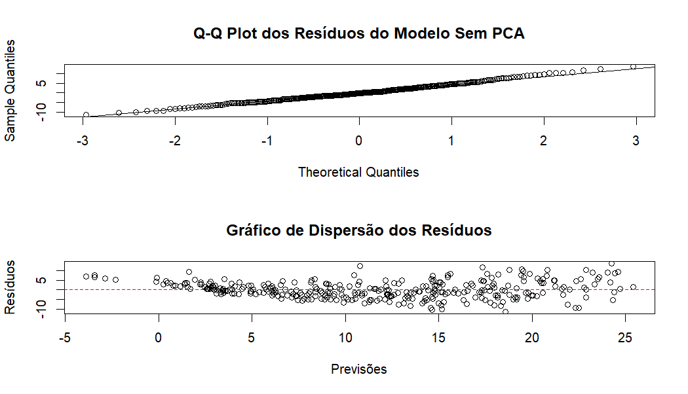
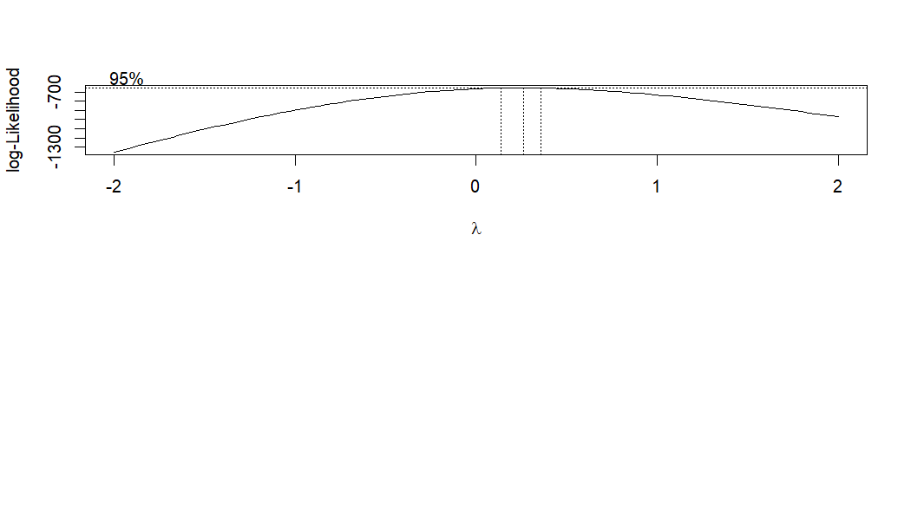

# Análise Estatística e Modelagem com PCA e Regressão Multivariada

##  Descrição
Este projeto utiliza o dataset **Ozone**, que contém dados meteorológicos coletados na Bacia de Los Angeles (1976), para modelar a concentração de ozônio atmosférico (\(O_3\)) em função de outras variáveis meteorológicas. O estudo aplica:
- **Regressão Linear Multivariada (MLR)** para modelar as relações entre as variáveis.
- **Análise de Componentes Principais (PCA)** para redução de dimensionalidade e tratamento de multicolinearidade.
- **Transformação de Box-Cox** para lidar com problemas de heterocedasticidade e não-normalidade.

---

##  Descrição Matemática
### 1. **Regressão Linear Multivariada**
A forma geral do modelo de regressão é:

$$
Y_i = \beta_0 + \beta_1X_1 + \beta_2X_2 + \cdots + \beta_pX_p + \varepsilon_i
$$

Os coeficientes \(\beta\) são estimados usando o método dos mínimos quadrados ordinários (OLS):

$$
\hat{\beta} = (X^T X)^{-1} X^T Y
$$

### 2. **Análise de Componentes Principais (PCA)**
A PCA transforma as variáveis originais \(X_1, X_2, \dots, X_p\) em componentes principais \(PC_1, PC_2, \dots, PC_k\), usando combinações lineares das variáveis originais. As variâncias explicadas (\(\lambda_k\)) auxiliam na seleção das componentes mais relevantes.

---

##  Metodologia
### Etapas
1. **Preparação dos Dados**: Exclusão de outliers e padronização das variáveis.
2. **Construção do Modelo**:
   - Regressão sem PCA para comparação.
   - PCA aplicado para gerar componentes não correlacionadas.
3. **Validação do Modelo**: Testes de normalidade (Shapiro-Wilk) e homocedasticidade (Breusch-Pagan).
4. **Transformação de Box-Cox**: Aplicada para melhorar o ajuste dos resíduos:

$$
y^\lambda =
\begin{cases} 
\frac{y^\lambda - 1}{\lambda} & \text{se } \lambda \neq 0 \\
\ln(y) & \text{se } \lambda = 0
\end{cases}
$$

---

##  Resultados e Visualizações

### 1. **Distribuição das Variáveis**

### 2. **Boxplot e Histograma do Ozônio (\(O_3\))**

### 3. **Correlação entre as Variáveis**
A matriz de correlação mostra fortes relações entre variáveis como `temp` e `vh`, destacando problemas de multicolinearidade.

### 4. **PCA e Redução de Dimensionalidade**
- O gráfico de variância explicada ilustra que os primeiros 5 componentes principais capturam cerca de 93% da variância.

- O biplot mostra a contribuição de cada variável nos dois primeiros componentes.

### 5. **Diagnóstico do Modelo**
#### Resíduos
- Os gráficos de dispersão e Q-Q plot mostram melhorias significativas após a transformação de Box-Cox e uso do PCA.

#### Transformação de Box-Cox
- O valor ótimo de \(\lambda\) foi encontrado próximo a \(0.5\), indicando a necessidade de transformação para raiz quadrada.

---

##  Conclusões
- O PCA foi eficaz na redução de dimensionalidade, preservando 93% da variância com 5 componentes.
- A transformação de Box-Cox corrigiu problemas de heterocedasticidade, melhorando a qualidade dos resíduos.
- O modelo final apresentou um \(R^2\) ajustado de 70.4%, com resíduos próximos da normalidade.

---

##  Referências
- Mardia, K.V., et al. *Multivariate Analysis*. Academic Press, 2000.
- Everitt, B. *Applied Multivariate Data Analysis*. Wiley Sons, 2001.
- Faraday, J.J. *Linear Models with R*. Chapman Hall/CRC, 2005.
